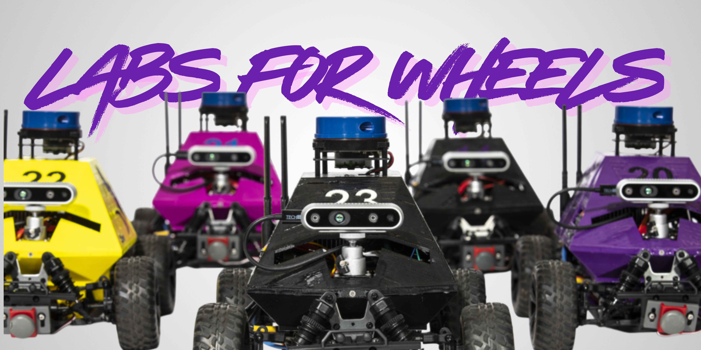

# Labs for Wheels



## Overview

**Labs for Wheels** is an **adaptation of [WheeledLab](https://github.com/UWRobotLearning/WheeledLab)** restructured as an isolated extension for Isaac Lab, enabling independent development of wheeled robotics capabilities.  
The goal of this project is to train robot "Hot Wheels" to drive and drift using deep reinforcement learning.

**Features:**
- Isolated extension outside core Isaac Lab repository
- Pre-configured RL environments (RSL-RL and skrl)
- Tasks: waypoint following, drifting, visual navigation, elevation

## Prerequisites

- Ubuntu 22.04+ (or Windows with WSL2)
- CUDA-capable GPU (NVIDIA recommended)
- Python 3.10 or 3.11
- Isaac Sim 5.1.0+
- Isaac Lab (latest version)

## Installation

### 1. Install Isaac Sim and Isaac Lab

```bash
# Create conda environment
conda create -n wheeled_lab python=3.10
conda activate wheeled_lab

# Install PyTorch (adjust CUDA version)
pip install torch==2.5.1 --index-url https://download.pytorch.org/whl/cu121  # CUDA 12.1
# OR
pip install torch==2.5.1 --index-url https://download.pytorch.org/whl/cu118  # CUDA 11.8

# Install Isaac Sim 5.1.0
pip install --upgrade pip
pip install 'isaacsim[all,extscache]==5.1.0' --extra-index-url https://pypi.nvidia.com

# Install Isaac Lab
git clone https://github.com/isaac-sim/IsaacLab.git
cd IsaacLab
./isaaclab.sh -i
```

See [Isaac Lab Installation Guide](https://isaac-sim.github.io/IsaacLab/main/source/setup/installation/index.html) for details.

### 2. Install Extension

```bash
# Clone repository (outside IsaacLab directory)
git clone <your-repo-url> wheeled_lab
cd wheeled_lab

# Install extension
conda activate wheeled_lab
python -m pip install -e source/wheeled_lab

# If not using conda/venv:
# <IsaacLab>/isaaclab.sh -p -m pip install -e source/wheeled_lab
```

### 3. Verify Installation

```bash
python scripts/list_envs.py  # Should show Template-WheeledLab-* environments
```

## Usage

### Available Tasks

| Shorthand | Full Name |
|-----------|-----------|
| `waypoint` | `Template-WheeledLab-Mushr-Waypoint-v0` |
| `drift` | `Template-WheeledLab-Mushr-Drift-v0` |
| `visual` | `Template-WheeledLab-Mushr-Visual-v0` |
| `elevation` | `Template-WheeledLab-Mushr-Elevation-v0` |

### Training

**RSL-RL:**
```bash
# Basic training
python scripts/rsl_rl/train.py --task waypoint --headless

# With options
python scripts/rsl_rl/train.py --task waypoint --headless --num_envs 2048 --seed 42 --max_iterations 1000 --video

# Switch drive mode (rwd or 4wd)
python scripts/rsl_rl/train.py --task drift --headless --drive_mode 4wd
```

**skrl:**
```bash
# Basic training (PPO default)
python scripts/skrl/train.py --task waypoint --headless

# Different algorithms: PPO, AMP, IPPO, MAPPO
python scripts/skrl/train.py --task waypoint --headless --algorithm AMP
```

### Playing/Inference

**RSL-RL:**
```bash
python scripts/rsl_rl/play.py --task waypoint --headless --num_envs 20 --checkpoint <path/to/checkpoint.pt>
```

**skrl:**
```bash
python scripts/skrl/play.py --task waypoint --headless --num_envs 20 --checkpoint <path/to/checkpoint.pt> --algorithm PPO
```

**Common Options:**
- `--task`: Task name (shorthand or full)
- `--headless`: Run without GUI
- `--num_envs`: Number of parallel environments
- `--seed`: Random seed
- `--video`: Record videos
- `--checkpoint`: Model checkpoint path
- `--device`: Device (`cuda` or `cpu`)
- `--drive_mode`: Drive mode (`rwd` or `4wd`) - switches between rear-wheel and four-wheel drive

**Test Environments:**
```bash
python scripts/zero_agent.py --task waypoint --headless
python scripts/random_agent.py --task waypoint --headless
```

## Development

### IDE Setup (VSCode)

1. Run setup task: `Ctrl+Shift+P` → `Tasks: Run Task` → `setup_python_env`
2. Add paths to `.vscode/settings.json`:
```json
{
  "python.analysis.extraPaths": [
    "<repo-path>/source/wheeled_lab",
    "<isaaclab-path>/source/isaaclab",
    "<isaaclab-path>/source/isaaclab_assets",
    "<isaaclab-path>/source/isaaclab_tasks",
    "<isaaclab-path>/source/isaaclab_rl"
  ]
}
```

### Code Formatting

```bash
pip install pre-commit
pre-commit run --all-files
```

## Troubleshooting

**Environments not found:**
- Verify installation: `pip install -e source/wheeled_lab`
- Check gymnasium registrations in task config files

**Import errors:**
- Verify Isaac Lab: `./isaaclab.sh -i`
- Check Python environment activation

**Pylance issues:**
- Add extension paths to `python.analysis.extraPaths` (see IDE Setup)
- Exclude Omniverse packages if memory issues occur

## References

- **WheeledLab**: [Repository](https://github.com/UWRobotLearning/WheeledLab) | [Paper](https://arxiv.org/abs/2502.07380)
- **MuSHR**: [Paper](https://arxiv.org/abs/1908.08031)

## License

Same license as Isaac Lab. See LICENSE file for details.
